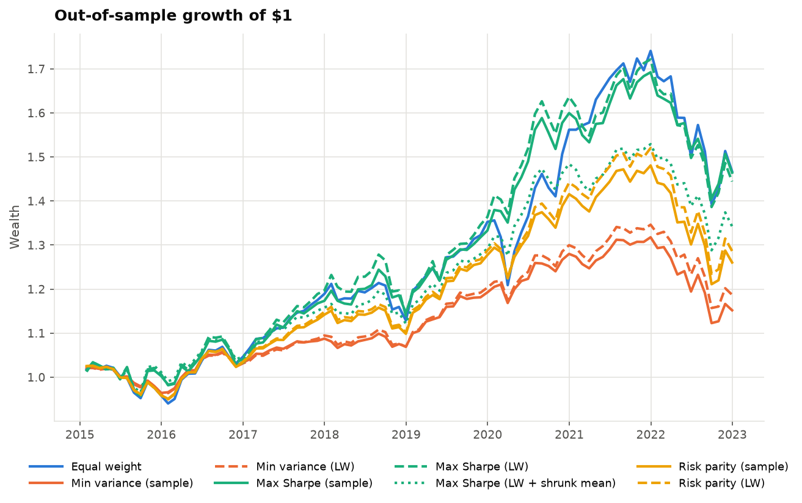
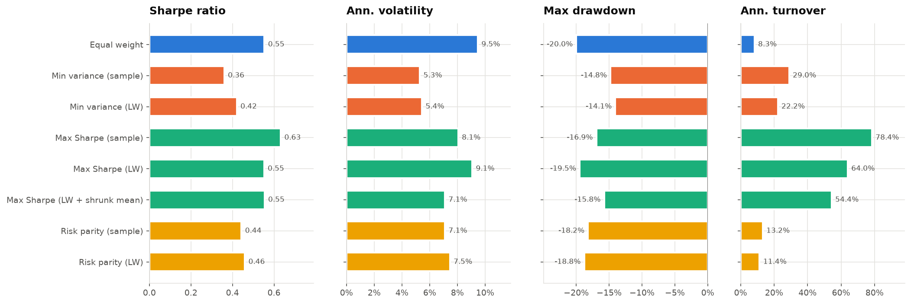
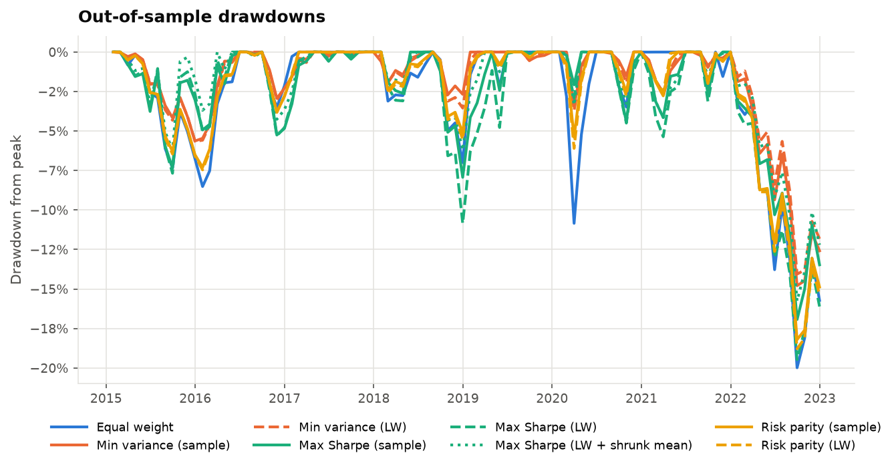
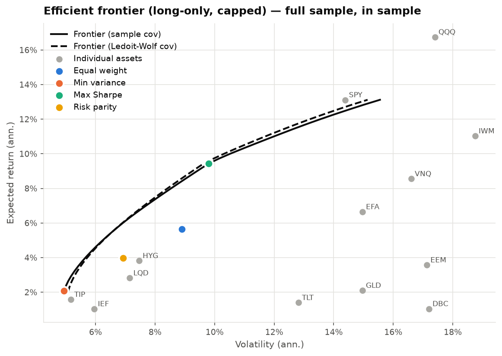
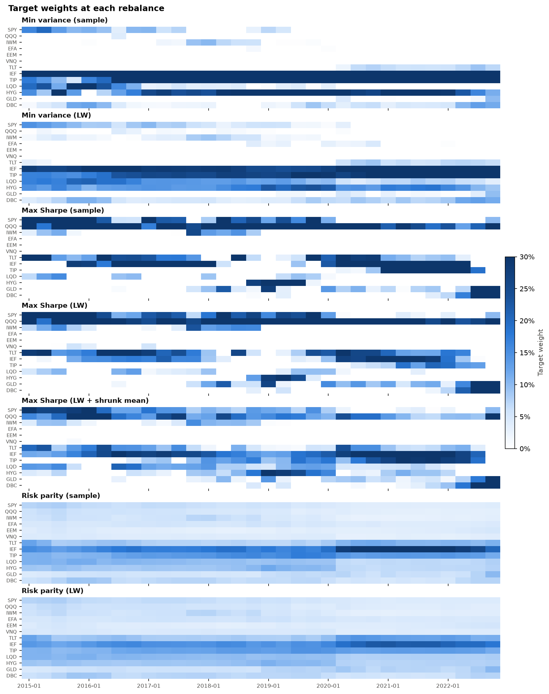

# Portfolio optimization: which allocation survives out of sample?

A Python rebuild of a portfolio study I first did in MATLAB, tested on 13 exchange-traded funds from 2012 to 2022.

## The short version

**The question.** Textbook portfolio optimization takes forecasts of each asset's return and risk and finds the "best" mix. On paper it always beats simply splitting your money equally. But in real life those forecasts have to come from past data, and past data is a noisy guide. So does the optimized portfolio still win once it has to work with real, imperfect forecasts?

**How I tested it.** Every three months from 2015 to 2022, each strategy looked only at the previous three years of data, picked its portfolio, and held it until the next update. Then I compared how they actually did over those eight years.



**What I found.**

- **No strategy reliably beat splitting the money equally.** The best optimized portfolio earned 0.52 units of return per unit of risk (its Sharpe ratio), against 0.46 for the equal split. A statistical test says a gap that small could easily be luck: if the two were really equally good, a gap at least this big would still show up 78% of the time.
- **The optimizer traded about nine times as much.** It replaced 77% of the portfolio each year, against 8% for the equal split, because small changes in its return forecasts kept moving its choices around.
- **A standard fix helped some strategies, but not the one that needed it most.** Ledoit-Wolf shrinkage cleans up the risk estimates, and it improved the strategies that rely only on risk. It didn't help the optimizer, whose real weakness was its return forecasts.

All the numbers, the tests behind them and their limits are below. Terms are explained in the [glossary](#glossary) at the end, and there's also a [commentary written by an AI model](results/commentary.md) from the results.

## What I tested

**Four ways to build a portfolio.** None of them can sell short, and none can put more than 30% in any one fund.

| Strategy | What it does | What it needs to forecast |
|---|---|---|
| Equal weight | Puts 1/13 of the money in each fund | Nothing |
| Minimum variance | Picks the mix with the lowest expected volatility | Risk only |
| Maximum Sharpe | Picks the mix with the best expected return per unit of risk | Risk and returns |
| Risk parity | Sets weights so each fund adds the same amount of risk | Risk only |

**Two ways to estimate risk.** The plain historical (sample) covariance matrix, and a Ledoit-Wolf shrunk version that's more stable when there isn't much data. Thirty-six months of data for 13 funds is not much.

**One way to tame the return forecasts.** A third version of maximum Sharpe pulls each fund's forecast return halfway toward the average of all 13 ("shrunk means"). It's deliberately simple, and it targets the problem that Ledoit-Wolf doesn't touch.

**How each strategy was tested.**

- Data: monthly returns, dividends included, January 2012 to December 2022, from Yahoo Finance.
- Each quarter, a strategy sees only the previous 36 months. It never sees the months it's about to be judged on.
- Between updates, the holdings drift with prices, the way a real portfolio would. Turnover counts only the trades needed to get back to the new target.
- Returns are measured against the 3-month US Treasury bill rate from the Federal Reserve Bank of St. Louis (FRED), which went from almost 0% in 2015 to over 4% by late 2022.
- That leaves 96 months of results for each strategy, from January 2015 to December 2022.

### The funds

| Ticker | Fund covers | Ticker | Fund covers |
|---|---|---|---|
| SPY | US large-company stocks (S&P 500) | TLT | US Treasury bonds, 20+ years |
| QQQ | US technology stocks (Nasdaq-100) | IEF | US Treasury bonds, 7-10 years |
| IWM | US small-company stocks | TIP | US inflation-protected Treasury bonds |
| EFA | Developed-market stocks outside the US | LQD | US investment-grade corporate bonds |
| EEM | Emerging-market stocks | HYG | US high-yield corporate bonds |
| VNQ | US real estate investment trusts | GLD | Gold |
| | | DBC | Broad commodities |

I picked funds that all existed well before 2012, so none of them join partway through.

## Results

`python -m portopt.run` rewrites this section from the latest run.

<!-- RESULTS:START -->
- **Data:** 13 exchange-traded funds (SPY, QQQ, IWM, EFA, EEM, VNQ, TLT, IEF, TIP, LQD, HYG, GLD, DBC), monthly, 2012-01 to 2022-12
- **Test period (out of sample):** 2015-01 to 2022-12 (96 months)
- **Estimation window:** 36 months, rebalanced every 3 months
- **Constraints:** no short selling, at most 30% in any asset, fully invested
- **Risk-free rate:** 3-month US Treasury bill (FRED series TB3MS), changing monthly; averaged 0.92% a year over the test period (lowest 0.02%, highest 4.15%)
- **Trading costs:** 0 basis points per trade

|                                            | Annual return   | Annual volatility   | Sharpe ratio   | Maximum drawdown   | Annual turnover   | Average largest weight   |
|:-------------------------------------------|:----------------|:--------------------|:---------------|:-------------------|:------------------|:-------------------------|
| Equal weight                               | 4.9%            | 9.5%                | 0.46           | -20.0%             | 8.3%              | 7.7%                     |
| Minimum variance (sample)                  | 1.8%            | 5.3%                | 0.19           | -14.8%             | 29.0%             | 30.0%                    |
| Minimum variance (Ledoit-Wolf)             | 2.2%            | 5.4%                | 0.25           | -14.1%             | 22.2%             | 29.0%                    |
| Maximum Sharpe (sample)                    | 5.4%            | 9.0%                | 0.52           | -17.1%             | 76.6%             | 30.0%                    |
| Maximum Sharpe (Ledoit-Wolf)               | 5.0%            | 9.8%                | 0.45           | -19.7%             | 66.4%             | 29.5%                    |
| Maximum Sharpe (Ledoit-Wolf, shrunk means) | 4.2%            | 7.6%                | 0.46           | -16.1%             | 65.0%             | 27.3%                    |
| Risk parity (sample)                       | 2.9%            | 7.1%                | 0.31           | -18.2%             | 13.2%             | 20.9%                    |
| Risk parity (Ledoit-Wolf)                  | 3.2%            | 7.5%                | 0.34           | -18.8%             | 11.4%             | 16.7%                    |

**Are the differences real?** Each strategy's Sharpe ratio compared with equal weight's, using 10,000 resampled histories built from 6-month blocks:

|                                            | Sharpe ratio   | Difference from equal weight   | 95% interval for the difference   | p-value   | Real difference? (p < 0.05)   |
|:-------------------------------------------|:---------------|:-------------------------------|:----------------------------------|:----------|:------------------------------|
| Minimum variance (sample)                  | 0.19           | -0.27                          | -0.63 to +0.12                    | 0.15      | no                            |
| Minimum variance (Ledoit-Wolf)             | 0.25           | -0.20                          | -0.53 to +0.15                    | 0.23      | no                            |
| Maximum Sharpe (sample)                    | 0.52           | +0.07                          | -0.44 to +0.57                    | 0.78      | no                            |
| Maximum Sharpe (Ledoit-Wolf)               | 0.45           | -0.01                          | -0.49 to +0.46                    | 0.98      | no                            |
| Maximum Sharpe (Ledoit-Wolf, shrunk means) | 0.46           | +0.00                          | -0.43 to +0.40                    | 0.98      | no                            |
| Risk parity (sample)                       | 0.31           | -0.14                          | -0.40 to +0.11                    | 0.26      | no                            |
| Risk parity (Ledoit-Wolf)                  | 0.34           | -0.12                          | -0.34 to +0.10                    | 0.28      | no                            |








<!-- RESULTS:END -->

### Do the results hold up under other settings?

`python -m portopt.robustness` reruns everything with trading costs, a tighter weight cap, five years of history instead of three, and a 0% risk-free rate.

<!-- ROBUSTNESS:START -->
Each cell is a Sharpe ratio, with the p-value against equal weight in brackets. All columns use the Treasury bill rate except the one that sets it to 0%.

|                                            | 36-month window (main setup)<br>tested 2015–2022   | Risk-free rate set to 0%<br>tested 2015–2022   | Trading costs of 0.1% per trade<br>tested 2015–2022   | Weight cap of 20%<br>tested 2015–2022   | 60-month window<br>tested 2017–2022   | 60-month window, 0.1% costs<br>tested 2017–2022   |
|:-------------------------------------------|:---------------------------------------------------|:-----------------------------------------------|:------------------------------------------------------|:----------------------------------------|:--------------------------------------|:--------------------------------------------------|
| Equal weight                               | 0.46                                               | 0.55                                           | 0.45                                                  | 0.46                                    | 0.49                                  | 0.49                                              |
| Minimum variance (sample)                  | 0.19 (p = 0.15)                                    | 0.36 (p = 0.32)                                | 0.18 (p = 0.14)                                       | 0.26 (p = 0.25)                         | 0.20 (p = 0.19)                       | 0.20 (p = 0.18)                                   |
| Minimum variance (Ledoit-Wolf)             | 0.25 (p = 0.23)                                    | 0.42 (p = 0.45)                                | 0.24 (p = 0.22)                                       | 0.27 (p = 0.27)                         | 0.26 (p = 0.26)                       | 0.25 (p = 0.26)                                   |
| Maximum Sharpe (sample)                    | 0.52 (p = 0.78)                                    | 0.63 (p = 0.73)                                | 0.51 (p = 0.82)                                       | 0.49 (p = 0.88)                         | 0.63 (p = 0.57)                       | 0.62 (p = 0.60)                                   |
| Maximum Sharpe (Ledoit-Wolf)               | 0.45 (p = 0.98)                                    | 0.55 (p = 1.00)                                | 0.44 (p = 0.95)                                       | 0.44 (p = 0.94)                         | 0.62 (p = 0.58)                       | 0.61 (p = 0.60)                                   |
| Maximum Sharpe (Ledoit-Wolf, shrunk means) | 0.46 (p = 0.98)                                    | 0.55 (p = 1.00)                                | 0.44 (p = 0.96)                                       | 0.45 (p = 0.99)                         | 0.64 (p = 0.49)                       | 0.63 (p = 0.53)                                   |
| Risk parity (sample)                       | 0.31 (p = 0.26)                                    | 0.44 (p = 0.40)                                | 0.31 (p = 0.25)                                       | 0.33 (p = 0.30)                         | 0.36 (p = 0.33)                       | 0.36 (p = 0.33)                                   |
| Risk parity (Ledoit-Wolf)                  | 0.34 (p = 0.28)                                    | 0.46 (p = 0.41)                                | 0.33 (p = 0.28)                                       | 0.34 (p = 0.29)                         | 0.38 (p = 0.36)                       | 0.38 (p = 0.36)                                   |
<!-- ROBUSTNESS:END -->

## What the results say

All numbers here are from the main setup (36-month window, 30% cap, no trading costs, Treasury bill rate), unless I say otherwise.

**Nothing beat the equal split by more than luck could explain.** Maximum Sharpe with the sample covariance had the best Sharpe ratio, 0.52 against 0.46. But the 95% interval for that gap runs from −0.44 to +0.57, so the data can't tell the two apart (p = 0.78). Across all six settings, no strategy's p-value gets below 0.14.

**Maximum Sharpe chased whatever had done well lately.** It usually held about five funds and swapped roughly a fifth of the portfolio every quarter, for 77% turnover a year. In 2022 you can watch it happen in the weights chart: as bonds fell, it moved out of Treasuries and inflation-protected bonds and into gold and commodities, hitting the 30% cap in both by October. Trading costs of 0.1% per trade barely dent its Sharpe ratio here, but all that trading bought no reliable improvement.

**Ledoit-Wolf shrinkage helped where you'd expect.** It raised the Sharpe ratio of minimum variance from 0.19 to 0.25 and of risk parity from 0.31 to 0.34, and it cut turnover for every optimized strategy. Those strategies only use the risk estimates, so cleaner risk estimates help them. Maximum Sharpe went the other way, from 0.52 to 0.45, because its weak input is the return forecasts.

**Shrinking the return forecasts did calm maximum Sharpe down.** Using the same Ledoit-Wolf risk estimates, pulling the forecasts toward their average cut volatility from 9.8% to 7.6% and the worst loss from 19.7% to 16.1%, with the same Sharpe ratio (0.45 and 0.46). With five years of history it had the best Sharpe ratio of any strategy, 0.64, though still not provably better than the equal split (p = 0.49).

**The risk-free rate matters most for low-risk portfolios.** Measuring against the Treasury bill rate instead of 0% lowered the equal split's Sharpe ratio from 0.55 to 0.46, but nearly halved minimum variance's, from 0.36 to 0.19. A 0.9% rate is a big bite out of a 2% return and a small one out of a 5% return.

**"Minimum variance" didn't mean safe in 2022.** Going into 2022 it held 95% in bonds, the funds that had been calmest over the previous three years. Then rates rose and bonds fell along with stocks. Despite 5% volatility it lost 15% from its peak. Every strategy hit its worst point in the same stretch, January to September 2022.

**Why the equal split is so hard to beat.** It doesn't forecast anything, so it can't get a forecast wrong. DeMiguel, Garlappi and Uppal (2009) found the same thing across many datasets: optimized portfolios built from historical estimates rarely beat the equal split out of sample. The no-short-selling rule and the 30% cap help the optimizers here, because they stop the most extreme bets that bad forecasts would otherwise produce.

## How it works

This part is more technical.

**Maximum Sharpe.** Maximizing a ratio isn't a convex problem, but a standard substitution makes it one. Write the weights as $w = y/\kappa$ with $\kappa > 0$ and fix the excess return at 1:

$$\min_{y,\kappa}\ y^\top \Sigma y \quad \text{subject to}\quad (\mu - r_f)^\top y = 1,\ \ \mathbf{1}^\top y = \kappa,\ \ 0 \le y \le c\,\kappa$$

That's a quadratic program, so the solver finds the true optimum and the weight cap $c$ stays linear. If no allowed portfolio is expected to beat the risk-free rate, there's nothing to maximize, so the strategy falls back to minimum variance and the run says how often that happened.

**Risk parity.** Without a cap, equal risk contributions have a convex formulation (Spinu, 2013): minimize $\tfrac12 y^\top\Sigma y - \sum_i b_i \log y_i$ and then rescale $y$ to sum to 1. When the result breaks the 30% cap, SciPy's sequential least squares programming (SLSQP) solver finds the capped portfolio whose risk contributions come closest to equal.

**Ledoit-Wolf shrinkage.** Blends the sample covariance matrix with a simple target (a scaled identity matrix), choosing the blend from the data. Here it averaged about 19% target, 81% sample. I used scikit-learn's implementation.

**Risk-free rate.** Each month uses the previous month's average 3-month Treasury bill yield divided by 12, the rate you could actually lock in at the start of the month. Maximum Sharpe gets the rate known on each rebalance date, so it never uses a future rate. If FRED can't be reached, the code falls back to Yahoo Finance's 13-week Treasury bill yield.

**Testing whether a gap is real.** With 96 monthly returns, a Sharpe ratio is only accurate to about ±0.35, so small gaps are easy to over-read. For each strategy, the code builds 10,000 alternative histories by drawing random 6-month blocks of the test period (a block bootstrap). Blocks keep calm and turbulent months together. The same blocks are used for the strategy and for equal weight, because the two move together month to month. The p-value is the share of these resampled gaps, centred on zero, that are as large as the real one.

**Backtest rules.**
- Weights chosen in month *t* use only months *t*−36 to *t*−1. One of the tests replaces all later data with random numbers and checks that earlier weights don't change.
- Turnover is one-way: half the sum of absolute weight changes at each rebalance, averaged per year. Buying the first portfolio from cash isn't counted.
- When trading costs are switched on, they're charged on both the buys and the sells.

## Running it

```bash
git clone https://github.com/pooja003-cloud/portfolio-optimization.git
cd portfolio-optimization
python3 -m venv .venv && source .venv/bin/activate      # on Windows: .venv\Scripts\activate
pip install -e ".[dev]"

python -m portopt.run            # downloads the data once, runs everything, updates this README
python -m portopt.robustness     # the robustness table above
python -m pytest                 # 38 tests
```

Other options:

```bash
python -m portopt.run --window 60     # five years of history instead of three (testing starts in 2017)
python -m portopt.run --cap 0.25      # at most 25% in any fund
python -m portopt.run --cost-bps 10   # charge 10 basis points (0.1%) per trade
python -m portopt.run --rf 0          # measure returns against 0% instead of Treasury bills
python -m portopt.run --synthetic     # offline demo on made-up data
```

**The AI commentary.** Each run saves a prompt to `results/commentary_prompt.md` containing only the setup and the results. The commentary in this repository came from pasting that prompt into Claude. If you have an Anthropic API key (billed separately from a Claude subscription), install with `pip install -e ".[dev,llm]"`, set `ANTHROPIC_API_KEY`, and the run writes `results/commentary.md` itself.

## Code layout

```
src/portopt/
  config.py        funds, dates, window length, weight cap
  data.py          downloads returns (Yahoo Finance) and the Treasury bill rate (FRED), with caching
  estimators.py    expected returns and covariance: sample, Ledoit-Wolf, shrunk means
  optimizers.py    the four strategies and the efficient frontier
  backtest.py      the rolling backtest, with drifting weights and turnover
  metrics.py       return, volatility, Sharpe ratio, drawdown, turnover
  stats.py         block-bootstrap test of Sharpe ratio differences
  robustness.py    reruns under different settings
  plots.py         charts
  commentary.py    builds the prompt for the AI commentary (optional API call)
  run.py           runs the whole study from the command line
tests/             38 tests, including no look-ahead, risk parity, costs, the bootstrap and risk-free rate timing
results/           tables, charts, chosen weights, monthly returns and the commentary
data/              cached fund returns and Treasury bill rates
```

## From MATLAB to Python

| MATLAB (Financial Toolbox) | Python version |
|---|---|
| `Portfolio`, `setDefaultConstraints` | no short selling and fully invested, written as `cvxpy` constraints |
| `setBounds(p, 0, 0.3)` | `cap=0.30` |
| `estimateFrontier`, `plotFrontier` | `efficient_frontier()`, `plot_frontier()` |
| `estimateMaxSharpeRatio` | `max_sharpe()` |
| `estimateFrontierLimits(p,'min')` | `min_variance()` |
| `estimateAssetMoments` | `estimators.estimate()` |
| `robustcov`, `shrinkcovariance` | `ledoit_wolf_cov()` |
| `quadprog`, `fmincon` | `cvxpy` (Clarabel and OSQP solvers), `scipy.optimize` |

## Limits and next steps

- This is one stretch of history and one set of funds. 2015 to 2022 had a long stock rally and then 2022, when stocks and bonds fell together. Both matter a lot for these rankings.
- Eight years isn't much for this kind of test. A real Sharpe ratio gap of 0.2 would usually go undetected, so "not significant" means "can't tell apart", not "the same".
- Things I'd try next: Black-Litterman return forecasts, hierarchical risk parity, a factor model for risk, a turnover penalty inside the optimizer, and starting in 2007 so the test includes 2008.

## Glossary

- **Basis point:** one hundredth of a percent. 10 basis points = 0.1%.
- **Block bootstrap:** a way to see how much a result could vary by chance, by rebuilding many alternative histories from random chunks (here, 6-month blocks) of the real one.
- **Covariance matrix:** how much each fund moves on its own (variance) and how pairs of funds move together. It's the "risk" input to the optimizers.
- **Drawdown, maximum drawdown:** how far a portfolio has fallen from its previous high. The maximum drawdown is the worst such fall.
- **Efficient frontier:** the set of portfolios with the highest expected return for each level of risk, given the forecasts. The chart in the results shows it in hindsight, using the whole 2012-2022 sample.
- **Estimation window:** how much past data a strategy uses to make its forecasts (36 months in the main setup).
- **Exchange-traded fund (ETF):** a fund that trades on a stock exchange like a single stock but holds a whole basket of assets.
- **Expected return:** the forecast of an asset's future return. Here, its average return over the estimation window.
- **In sample, out of sample:** in-sample results are measured on the same data used to build the portfolio, which flatters it. Out-of-sample results are measured on data the strategy hadn't seen, which is the fair test.
- **Ledoit-Wolf shrinkage:** blends the historical covariance matrix with a simpler, more stable one, so that noise in a short history doesn't produce extreme portfolios.
- **p-value:** the chance of seeing a gap at least this large if the two strategies were really equally good. Below 0.05 is the usual bar for calling a gap real.
- **Rebalancing:** trading back to the target weights. Here it happens every three months.
- **Risk-free rate:** what you could earn with essentially no risk, here the 3-month US Treasury bill rate.
- **Sharpe ratio:** return above the risk-free rate, divided by volatility. Higher means more return for each unit of risk taken.
- **Short selling:** betting on a price fall by selling something you've borrowed. None of the strategies here do it.
- **Shrunk means:** return forecasts pulled toward their overall average to reduce noise.
- **Turnover:** how much of the portfolio is traded. 77% a year means trades worth 77% of the portfolio's value were bought over the year.
- **Volatility:** how much returns swing around, measured as the annualized standard deviation of monthly returns.
- **Weight cap:** the most any one fund can make up of the portfolio. 30% here.
